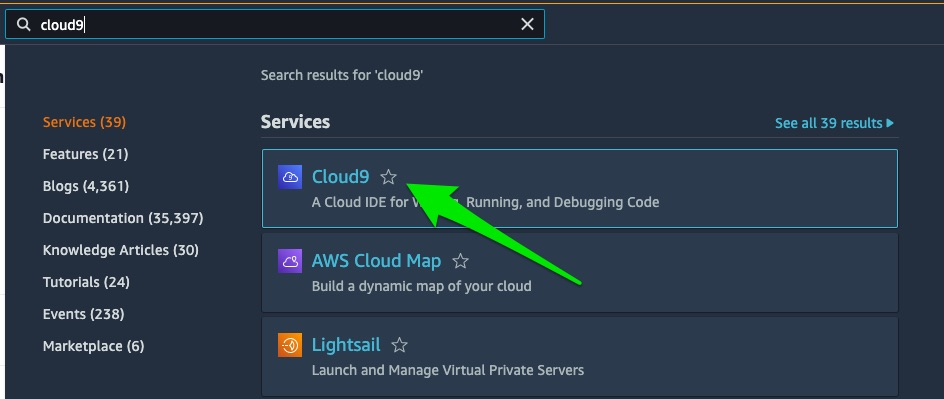
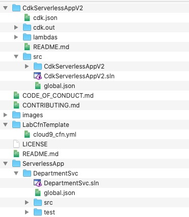

# Build a serverless application using AWS CDK for .NET


## Solution Overview


## Let's get started

Before we begin, we will need to login into AWS Cloud9. Cloud9 is a cloud-based integrated development environment (IDE) that lets you write and run code with just a browser. All code required to setup the lab is prepared, participants are only required to run the scripts in Cloud9.

To access Cloud9 search for Cloud9 in the AWS Console and click on Cloud9.





Under Your environments, open the _Serverless App DevLab CDK (Level 200)_ Cloud9 instance by clicking on Open IDE:


## Step 1: Refresh your environment

Please refresh your environment by running the following commands:

```bash
cdk destroy
cd ~/environment/
rm -r serverless-app-demo-using-aws-cdk-dotnet
```

## Step 2: Setting up the environment

### Verify .NET version

Execute the following command to verify .NET version:
```bash
dotnet --version
6.0.300
```

It should be 6.0.xxx. If .NET is not installed, then follow the instructions below: 

### Install .NET 6.0

Execute the following command to add the Microsoft package signing key to your list of trusted keys and add the Microsoft package repository before installing .NET Core 6:

```bash
sudo rpm -Uvh https://packages.microsoft.com/config/centos/7/packages-microsoft-prod.rpm
```

Execute the following command to install the .NET SDK:

```bash
sudo yum install dotnet-sdk-6.0 -y
dotnet new tool-manifest
dotnet tool install Amazon.Lambda.Tools
```

### Verify CDK version

Execute the following command to verify the CDK version:

```bash
cdk --version
2.23.0 (build 50444aa)
```
It should be 2.23.0 or above. If CDK version is less than 2.23.0, then follow the instructions below: 


```bash
npm uninstall -g aws-cdk
rm /home/ec2-user/.nvm/versions/node/v16.15.0/bin/cdk
npm install -g aws-cdk@2.23.0
```

## Step 3: Clone and setup the AWS CDK application

On your local machine, clone the AWS CDK application with the following command:

```shell
git clone https://github.com/aws-samples/serverless-app-demo-using-aws-cdk-dotnet.git
```

Directory structure after cloning:




## Step 4: Package the NET 6 lambda function

The DepartmentSvc lambda function in the ServerlessApp directory must be packaged and copied to the CdkServerlessApp\lambdas folder.

```bash
cd serverless-app-demo-using-aws-cdk-dotnet/ServerlessApp/DepartmentSvc/src/DepartmentSvc/
dotnet lambda package
cp bin/Release/net6.0/DepartmentSvc.zip ../../../../CdkServerlessAppV2/lambdas
```


## Step 5: Run AWS CDK Application

Build the CDK code before deploying to the console:

```bash
cd ../../../../CdkServerlessAppV2/src
dotnet build
cd ..
```

#### A quick overview of the AWS CDK application

Before we deploy the application, let's look at the code. First look at the directory structure:

```shell
.
├── README.md
├── cdk.json
├── cdk.out
│   ├── CdkServerlessAppV2Stack.assets.json
│   ├── CdkServerlessAppV2Stack.template.json
│   ├── asset.0e1f2e2dc3aa52037a9195a6ccb6a2fb44bc4f3e1a52bdf2792b99d1965ebd0b.zip
│   ├── cdk.out
│   ├── manifest.json
│   └── tree.json
├── lambdas
│   ├── DepartmentSvc.zip
│   └── README.md
└── src
    ├── CdkServerlessAppV2
    │   ├── CdkServerlessAppV2.csproj
    │   ├── CdkServerlessAppV2Stack.cs
    │   ├── GlobalSuppressions.cs
    │   ├── Program.cs
    ├── CdkServerlessAppV2.sln
    └── global.json
```

The cdk.json file tells the AWS CDK Toolkit how to execute your app.


Before you deploy any AWS CDK application, you need to bootstrap a space in your account and region you are deploying into. To bootstrap in your default region, issue the following command:

```bash
cdk bootstrap
```


If you want to deploy into a specific account and region, issue the following command:

```bash
cdk bootstrap aws://ACCOUNT-NUMBER/REGION
```

Replace ACCOUNT-NUMBER/REGION with your account number and region respectively. For more information, visit [Getting started with the AWS CDK](https://docs.aws.amazon.com/cdk/latest/guide/getting_started.html)


At this point you can now synthesize the [AWS CloudFormation](https://aws.amazon.com/cloudformation/) template for this code.

```shell
cdk synth
cdk deploy
```

CDK deploys the environment to AWS. Enter 'y' when prompted for confirmation.


## Step 6: Verify resources in console

You can monitor the progress using the CloudFormation console.


## Step 7: Review the resource creation code

#### Create IAM roles

```cs
#region iamroles

var iamLambdaRole = new Role(this,"LambdaExecutionRole", new RoleProps
{
    RoleName = "LambdaExecutionRole",
    AssumedBy = new ServicePrincipal("lambda.amazonaws.com")
});

iamLambdaRole.AddManagedPolicy(ManagedPolicy.FromAwsManagedPolicyName("AmazonDynamoDBFullAccess"));
iamLambdaRole.AddManagedPolicy(ManagedPolicy.FromAwsManagedPolicyName("CloudWatchLogsFullAccess"));
iamLambdaRole.AddManagedPolicy(ManagedPolicy.FromAwsManagedPolicyName("AWSXrayFullAccess"));
iamLambdaRole.AddManagedPolicy(ManagedPolicy.FromAwsManagedPolicyName("CloudWatchLambdaInsightsExecutionRolePolicy"));
iamLambdaRole.AddToPolicy(new PolicyStatement(new PolicyStatementProps
{
    Effect = Effect.ALLOW,
    Actions = new [] {"cloudwatch:PutMetricData"},
    Resources = new [] {"*"}
}));

#endregion iamroles
```

#### Create DynamoDB table

The following snippet creates a DynamoDB table with AWS CDK for .NET:

```cs
#region DynamoDB tables

var departmentTable = new Table(this, "Department", new TableProps
{
    TableName = "Department",
    PartitionKey = new Attribute
    {
        Name = "DeptId",
        Type = AttributeType.NUMBER
    },
    RemovalPolicy = RemovalPolicy.DESTROY,
    ContributorInsightsEnabled = true
});

#endregion
```

#### Create Lambda function

```cs
#region Lambda

var DepartmentSvcLambda = new Function(this,"DepartmentSvc", new FunctionProps
{
    FunctionName = "DepartmentSvc",
    Runtime = Runtime.DOTNET_6,
    Handler = "DepartmentSvc::DepartmentSvc.Function::FunctionHandler",
    Role = iamLambdaRole,
    Code = Code.FromAsset("lambdas/DepartmentSvc.zip"),
    Timeout = Duration.Seconds(300),
    Tracing = Tracing.ACTIVE
});

#endregion
```

## Step 8: Test the serverless app

1. Open API Gateway in AWS console.
1. Under APIs, click on DeptAPI to open the _Resources_ page.
1. Select **ANY** under /dept resource, and click on **TEST**.


##### POST
Select the method as POST and enter the request body as below and click on Test button. This will create an item in the DynamoDB table.
```json
{
    "DeptId": 1,
    "DeptName": "Human Resources"
}
```

##### GET
Select the method as GET and enter the query string as below and click on Test button. This will retrieve the item with the deptId provided from the DynamoDB table.

Query string:
deptId=1

##### PUT
Select the method as PUT and enter the request body as below and click on Test button. This will update the item with the department name provided in the DynamoDB table.
Request body:
```json
{
    "DeptId": 1,
    "DeptName": "Finance"
}
```

##### DELETE
Select the method as DELETE and enter the request body as below and click on Test button. This will delete the item with the deptId provided in the DynamoDB table.
Request body:
```json
{
    "DeptId": 1
}
```

##### POST
Select the method as POST and enter the request body as below and click on Test button. This will delete the item with the deptId provided in the DynamoDB table.
Request body:
```json
{
    "DeptId": 2,
    "DeptName": "Marketing"
}
```


## Step 9: View data in DynamoDB table

1. Open DynamoDB console, and click on _Tables_ on the left menu.
1. Click on **Department** in the listed tables.
1. Select the _Explore table items_ on the top right corner of the page.


## Step 10: Cleaning up

To avoid incurring additional charges, clean up all the resources that have been created. Run the following command from a terminal window. This deletes all the resources that were created as part of this example.

```bash
cdk destroy
cd ~/environment/
rm -r serverless-app-demo-using-aws-cdk-dotnet
```


## License Summary

This sample code is made available under a modified MIT license. See the LICENSE file.


## Feedback Survey

Thank you for your interest in this lab. We would love your feedback. Kindly fill out this [survey](https://eventbox.dev/survey/Q9O3WQU).
